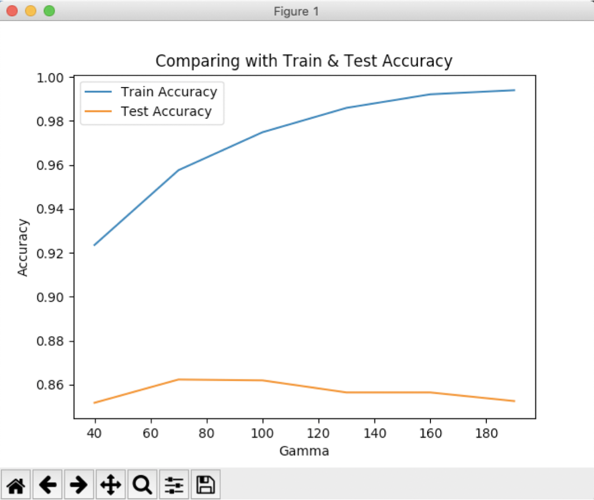

# Prediction of Anti-Fungal Peptides
## About
This repository is about predicting the anti-fungal peptide sequences. Along with predicting, this code also finds the Train & Test accuracy with K- Fold method and 5 folds. 

**[Kaggle Link](https://www.kaggle.com/c/iqb2020)**

Files required:

* **train.csv:** This file has three columns, the first column contains ID (sequence number), the second column contains contain the label (-1 for negative and +1 for positive sample) and the third column contains the sequence of peptide in a single  sting.

* **test.csv:** This file has two columns, the first column contains ID and the second column contains the peptide sequence.

The model will train based on train.csv and predict the labels of the peptide sequences in test.csv

The output will be of two columns: first column containing the ID (sequence number) and the second column will contain the predicted label (-1 for negative and +1 for positive). 

## Syntax Format

```
python3 final.py -o <output File> -type {aminoacid | dipepeptide | tripeptide} -model {SVC | RFC} { {-gamma | -n_estimators} <positive value> | -optimalParameters }
```

## Understanding of Syntax

* Type can only be ‘aminoacid’, 'dipeptide' or ‘tripeptide’. These are the different ways of parsing the input peptide.
* Models:
	* SVC: Support Vector Classifier 
	* RFC: Random Forest Classifier
* -gamma and -n_estimators are the parameters we pass into these models.
* -optimalParameters is a mode where it runs the model multiple times and plots the accuracy for the parameters. This way, we can find out the optimal gamma/n_estimators for a particular model.

## Please Note

* gamma can only be used if model is SVC.
* n_estimators can only be used if model is RFC.
* gamma & -n_estimators have to be positive values
* outputFile is preferred with .csv format
* In -optimalParameters, 3 inputs will be asked: start, end, step indexes for the parameters.
* If -optimalParameters mode is used, -gamma < val > cannot be used for obvious reasons.

## Best Models

Model: RFC\
Type: Tripeptide\
n_estimators: 700\
CSV stored in: best1.csv\
Code in: best1.py

```
python3 final.py -o best1.csv -type tripeptide -model RFC -n_estimators 700
```

>Output exported in best1.csv\
Avg Train Accuracy:  1.0\
Avg Test Accuracy:  0.8901960784313726

Model: SVC\
Type: Tripeptide\
n_estimators: 15\
CSV stored in: best2.csv\
Code in: best2.py

```
python3 final.py -o best2.csv -type tripeptide -model SVC -gamma 15
```

>Output exported in best2.csv\
Avg Train Accuracy:  0.9859803921568627\
Avg Test Accuracy:  0.8741176470588237

Model: SVC\
Type: Dipeptide\
n_estimators: 91\
CSV stored in: best3.csv\
Code in: best3.py

```
python3 final.py -o best3.csv -type dipeptide -model SVC -gamma 91
```

>Output exported in best3.csv\
Avg Train Accuracy:  0.9981372549019607\
Avg Test Accuracy:  0.8631372549019607

## Example Syntax of optimalParameters

```
python3 final.py -o a.csv -type dipeptide -model SVC -gamma 91
```

>Output exported in a.csv\
Avg Train Accuracy: 0.9981372549019607\
Avg Test Accuracy: 0.8631372549019607

```
python3 final.py -o b.csv -type tripeptide -model RFC -n_estimators 700
```

>Output exported in b.csv\
Avg Train Accuracy: 1.0\
Avg Test Accuracy: 0.8874509803921569

```
python3 final.py -o a.csv -type aminoacid -model SVC -optimalParameters
```

>Enter start parameter: 40\
Enter end parameter: 200\
Enter step parameter: 30\
Gamma : 40\
Avg Train Accuracy:  0.9235294117647058\
Avg Test Accuracy:  0.851764705882353\
Gamma : 70\
Avg Train Accuracy:  0.9575490196078432\
Avg Test Accuracy:  0.8623529411764705\
Gamma : 100\
Avg Train Accuracy:  0.9748039215686275\
Avg Test Accuracy:  0.8619607843137255\
Gamma : 130\
Avg Train Accuracy:  0.9858823529411765\
Avg Test Accuracy:  0.8564705882352941\
Gamma : 160\
Avg Train Accuracy:  0.9920588235294119\
Avg Test Accuracy:  0.8564705882352941\
Gamma : 190\
Avg Train Accuracy:  0.993921568627451\
Avg Test Accuracy:  0.8525490196078431



## Example Syntax of Wrong Input

```
python3 final.py -o c.csv -type tripeptide -model SVC -n_estimators 700
```

>Invalid set of arguments. Please see README

```
>python3 final.py -o c.csv -type tripeptide -model SVC
```

>Invalid length of arguments. Please see README